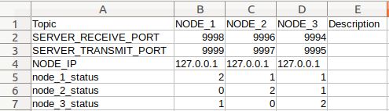

# README #

### Project Scope: ###

* UDP Data distribution system based on python3 UDP sockets for handling messages between nodes.
* CSV based matrix to describe node communication settings and relation between topics and nodes.
* Purpose of matrix is to always have an overview topics, and only distribute messages to nodes that require that message.


### How do I get set up? ###

* TopicMatrix.csv


TopicMatrix:\



Message structure:


Server Message Handling:\


##### Start server:
```python
import udpdds

with open("TopicMatrix.csv", "r") as f:
    topic_matrix = f.readlines()
    f.close()

test_server = udpdds.Server(topic_matrix)
test_server.start_server()

```

##### Start node:
```python
import udpdds

node_1 = udpdds.Client(ip="127.0.0.1", server_recv_port=9998,
                      server_transmit_port=9999, node_name="NODE_1")

node_1.start_client()

```
